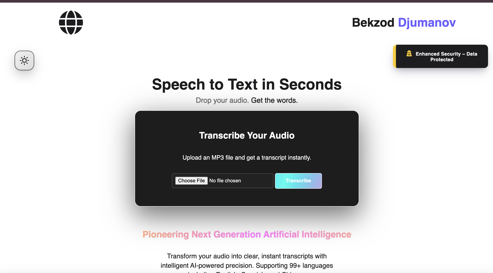
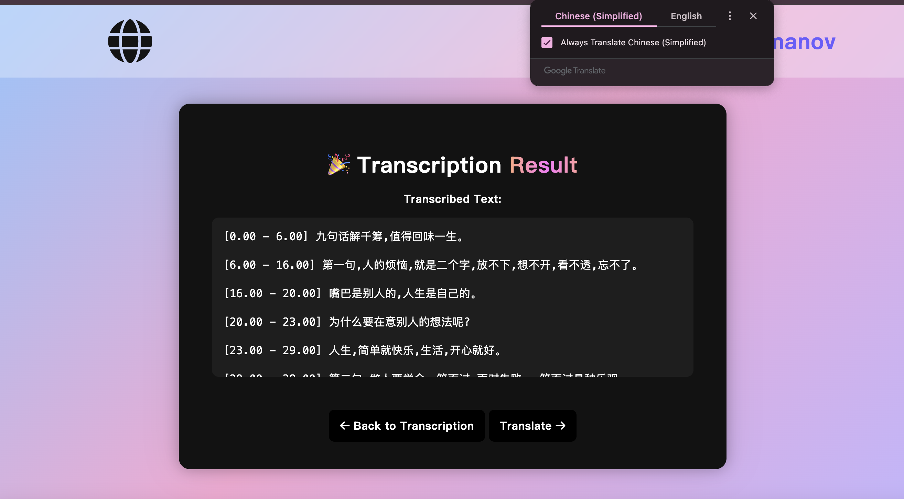

# AI Speech-to-Text API 🎙️➡️📝

A Flask-based REST API that uses OpenAI's Speech Recognition model to convert uploaded `.mp3` audio files into transcribed text.

⚠️ Due to maintenance costs, I have temporarily shut down the public site. Further information will be provided soon. Thank you for your understanding.

<div align="center">
  
  
</div>

## 🚀 Features

- 🎧 Upload `.mp3` audio files
- 🧠 Transcribe using Open AI, supporting 99+ languages
- 🔁 Returns transcribed text that can be translated to any language available on google translate
- 🔓 Leverages Flask and JS to decipher speech-based posts, optimizing request handling.
- 🛠️ Fully configured frontend and backend pipeline system designed for deployment

## 💭 Technological Landscape

With the prevalence of artifical intelligence, the opportunities for discovering new technological capabilities have sprouted. Open AI has conformed to the general public by allowing contribution for their open source platform - Whisper AI. This implementation will spark a crescendo, reverberating the impacts of unbounded technological indulgence. Albeit this decision may seem perilous at best, individual's akin to myself will be able to contribute significant and relevant discoveries into the scope of artifical intelligence.

## 🔒 Security

**_All files and relavent data is kept anonymous and secured._**

⚔️ The framework of this project remains and will not contravene with the ethical foundation of programming and software application. ⚔️

## 🔧 Requirements

- Python 3.8+

- pip (Python package manager)

- FFmpeg (for audio decoding)

- Modern web browser (for frontend interface)

- Flask

- Whisper AI

## 📦 Application

### Install Python dependencies

```
pip install -r requirements.txt
```

### Install FFmpeg

macOS (via Homebrew):

```
brew install ffmpeg
```

### Ubuntu

```
sudo apt update
sudo apt install ffmpeg
```

### Windows

```
Download and install FFmpeg from https://ffmpeg.org/download.html, then add it to your system's PATH.
```

## ⏯️ Run

```
python3 app.py
```
